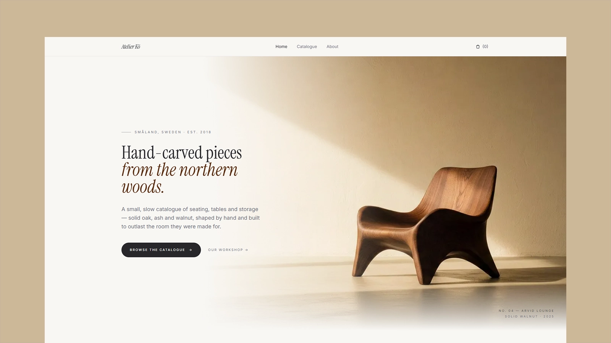

# Atelier Kō - Minimalist Furniture Store Theme

[](https://atelier-ko-topaz.vercel.app/)


Preview: [https://atelier-ko-topaz.vercel.app/](https://atelier-ko-topaz.vercel.app/)

Atelier Kō is a quiet, editorial Astro theme for a small furniture atelier or craft-led product catalogue. Fully static, with small JavaScript enhancements for the catalogue filters, product gallery, and local cart.

## Features

- Polished homepage with hero, featured products, material story, newsletter form, and footer
- Catalogue page with client-side category and material filters, and price sorting
- Static product detail pages generated from Markdown content with Zod-validated frontmatter
- Product image gallery with thumbnail navigation
- LocalStorage cart with quantity controls and a multi-step checkout preview
- About page with workshop story, principles, image-led sections, and contact CTA
- Astro-optimized images served in WebP with responsive widths
- Self-hosted WOFF2 fonts (Inter, Instrument Serif) — no external requests
- Full SEO: canonical URLs, Open Graph, Twitter cards, Product and Organization JSON-LD, sitemap, dynamic `robots.txt`
- Accessible: skip-to-content link, ARIA labels, focus-managed mobile menu, semantic HTML
- Strict TypeScript throughout

## Tech Stack

- Astro 6
- Tailwind CSS 4
- TypeScript (strict)
- Static output

## Getting Started

```bash
npm install
npm run dev
```

Build for production:

```bash
npm run build
```

Preview the production build locally:

```bash
npm run preview
```

## Theme Setup

Update the production URL before publishing:

```bash
SITE=https://your-domain.com npm run build
```

The configured `site` value is used for canonical URLs, sitemap generation, and `robots.txt`. The default preview site is `https://atelier-ko-topaz.vercel.app/`.

Main content files:

- `src/content/products/*.md` — product catalogue entries, frontmatter, images, and descriptions
- `src/content.config.ts` — product content collection schema
- `src/data/products.ts` — helper utilities that read and sort product content
- `src/layouts/BaseLayout.astro` — shared metadata, global shell, header/footer slots, and cart helper
- `src/components/SiteHeader.astro` — navigation and cart badge
- `src/components/SiteFooter.astro` — footer links and studio copy
- `src/styles.css` — design tokens, Tailwind setup, and local font declarations

## Adding Products

Add one Markdown file per product in `src/content/products/`. The file name becomes the product URL slug, so `arvid-chair.md` becomes `/products/arvid-chair`.

```md
---
name: Arvid Chair
collection: Collection 01 — Seating
category: Seating
material: Ash
price: 840
shortDescription: Curved Ash
dimensions: W 54 × D 56 × H 92 cm
finish: Soap-Treated
leadTime: 6–8 Weeks
images:
  - ../../assets/p-arvid-1.jpg
  - ../../assets/p-arvid-2.jpg
order: 2
---

A single sculpted shell of steam-bent ash, the Arvid Chair traces the silhouette of the body.
```

Product images should live in `src/assets/` so Astro can optimize them. Categories and materials are derived automatically from the product files and appear as catalogue filters.

## Pages

- `/` — Homepage
- `/catalog` — Full catalogue with filters
- `/products/[slug]` — Product detail
- `/about` — Studio story
- `/cart` — Cart and checkout preview

## Images and Fonts

Theme images live in `src/assets` and render through Astro's image pipeline. Local fonts live in `src/assets/fonts`; only the weights and styles used by the theme are included.

Use `public/` only for files that should be served as-is.

## SEO

- Unique page titles and descriptions
- Canonical URLs
- Open Graph and Twitter card metadata
- Sitemap generation via `@astrojs/sitemap`
- Dynamic `robots.txt`
- Product JSON-LD on product pages
- Organization JSON-LD on the homepage
- `noindex` on cart and 404

## Deployment

The theme builds to static files in `dist/` and deploys to any static host. Set `SITE` to the production origin during deployment so SEO URLs are correct.

## License

This project is licensed under the [MIT License](LICENSE).

## Notes

- Replace the demo product copy, prices, and images with your own catalogue before publishing.
- The newsletter and checkout flows are design previews; connect them to your preferred backend or form provider if needed.
